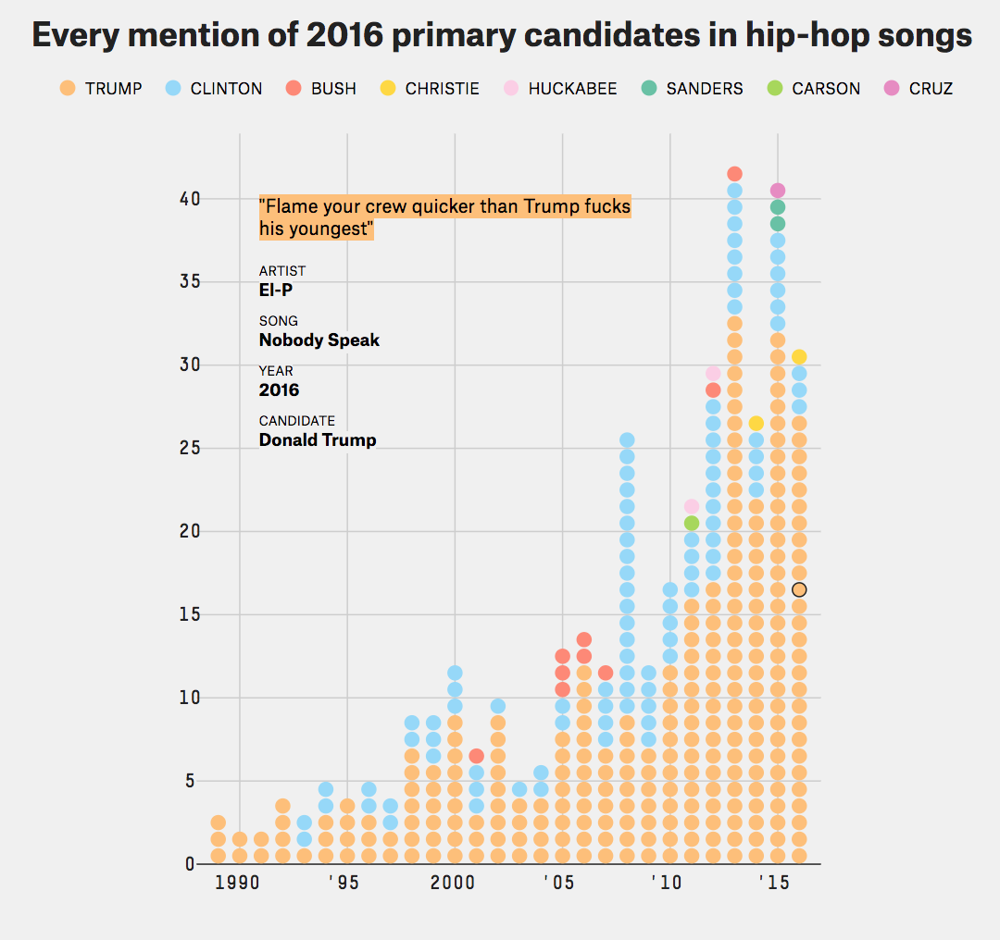

# Assessment 3

[link to the project](https://leoniesmits.github.io/fe3-assessment-3/)

As the final assesment of Front-End 3, this is the visualisation of data I made.
This readme will tell you about the steps I've taken to the final result, the dataset and all the struggles I've had.

#### The steps taken in the process

###### 1. Figuring out the idea
My first step, after figuring out the graphs and interaction I wanted to make, I started to search for similar graphs. The ones that I used mostly were [Martin Chorley's Bar chart](https://bl.ocks.org/martinjc/8a2a545d5c48ef1ff65b747554332e3d), [Mike Bostock's Arctween](http://bl.ocks.org/mbostock/5100636) and [this interactive bar chart](http://bl.ocks.org/jonahwilliams/2f16643b999ada7b1909)

###### 2. Finding the dataset

To use my own data (from [FiveThirtyEight](https://github.com/fivethirtyeight/data/blob/master/hip-hop-candidate-lyrics/genius_hip_hop_lyrics.csv)) it was a huge struggle. I started with a Pie chart, and my plan was to add up the sentiments used in the data per year. After searching and asking around, I found [this link](https://developer.mozilla.org/en-US/docs/Web/JavaScript/Reference/Global_Objects/Array/reduce). Instead of already altering and cleaning the data, I used dummy data to play with the pie chart first. I wanted to know if my plan would work, so that was the first priority. In this step, the main goal was to find some cool data, and I did


###### 3. Starting the pie chart
I started with a function to make the pie chart, according to [this github article](https://github.com/valor-software/ng2-charts/issues/619) as I was concerned about the colors. The function to make the pie chart is really long and starts with the measurements of the svg, the path and the layout of the pie (the slices). After the svg is specified, the path is specified. The first thing specified, is the color of the sentiments. The sentiments are the negative, neutral or positive labels the lyrics got. I call these three things sentiments. After the function to make the charts, the first thing specified is this: 
```javascript
    function sentimentColor(c){ 
        return {negative:"#F97C7C",
                neutral:"#CCCCCC",
                positive:"#58E8A9"}[c];}
```
In here, the parameter c gives back the selected sentiment. All sentiments are specified and given a color. This was important, because the colors help the user understand the statements.

A pie chart is round, so it needs .arc and .innerradius and .outerradius. The following aspect is the hardest in this part. In the variable pie, the layout is specified as in [this example](https://bl.ocks.org/jiankuang/a591ff3331044f8c9a59764a1424bb07).
```javascript
        var pie = d3.layout.pie()
            .sort(null).value(function(d) { 
                return d.sentiment; 
            });
```
The layout is specified and the .sort is used to have the biggest amout on the left side. By using .value and returning d.sentiment, the sentiments are totaled and can be put in the pie chart. For the later plan of altering the pie chart by hovering the bar charts and filtering the data by year, this step is very important. As the data is filtered, it goes through this piece of code and is transformed into this format. 

###### 4. Making the pie chart dynamic

In the pieChart function, there are 4 functions. The first, is to update the chart. This is after the pieChart is made, so the default chart shows the total of the data. A parameter is given, called yearSentiment. This refers to a variable which is later specified and connects to the mouseover function in the bar chart, connecting the to charts.
```javascript
        pC.update = function(yearSentiment){
            pCsvg.selectAll("path")
            .data(pie(yearSentiment))
            .transition().duration(400)
            .attrTween("d", function pieSlices(a) {
            });
        }   
```
This shows the update function to update the bar chart. The d3 function .attrTween is used here, coming from [this example](http://bl.ocks.org/mbostock/5100636).
This alters the "d" attribute (the path), making the slices move. The .attrTween refers to another function, called pieSlices. This function has to return the right slices in the pie after the update. The function continues like this:
```javascript
.attrTween("d", function pieSlices(a) {
                var i = d3.interpolate(this.current, a);
                this.current = i(0);
                return function(t) { 
                    return path(i(t));    
                };
            }) 
```
The d3.interpolate is from [this example](http://bl.ocks.org/mbostock/5100636). This is used to draw lines between two angles and keeping true to the pie chart shape. The data can be extracted form the total data, or the selected data from the bar chart. The index is extracted as an object and given back in the path between the angles.

The next functions in the pieChart, are mouseover en mouseout. Both have parameter d, to refer to the data. By hovering the pie chat slice, this has to refer to the right year. Within this function, another function is called to .map the data and return the right color of the selected sentiment. The parameter v gives back an object of the selected sentiment for their year. 

```javascript
        function mouseover(d){
            bC.update(myData.map(function(v){ 
                return [v.year,v.sentiment[d.data.type]];})
                ,sentimentColor(d.data.type));
        }
```
After the mouseover, make a mouseout function. Call an update in the bar chart refering to the dataset and return the previous data and color
```javascript
        function mouseout(d){
            bC.update(myData.map(function(v){
                return [v.year,v.total];}), "#8DD4F4");
        }
```
After this, return the pieChart and visualize everything specified before.
```javascript
        return pC;
    }
```
Finally, map the sentiments from the code as an object and write a function to put the sentiments as type. By using d3.sum to specify you need the value extracted from the sentiments. This is for example negative:1 neutral:4. First return this value and then return the type of sentiment in the data.
```javascript
    var updatePC = ['negative','neutral','positive']
        .map(function(d) { 
            return {type:d, sentiment: d3.sum(myData.map(function(t) { 
                return t.sentiment[d];
            }))};
        });  
```
###### 5 Making the legend

The legend is the second part of this project, as it's important to understand the pie chart. This function starts with an empty object aswell, called "leg". The legend consists of a table, inside a tbody, 3 td elements and they each have 3 tr's.
For the second row, I used this function to put the data in the text.  In the second function you can see how I put the percentages in the text.
```javascript
        tr.append("td").attr("class",'legendsentiment')
            .text(function(d) { 
                return d3.format("1")(d.sentiment);
            });

        tr.append("td").attr("class",'legendPerc')
            .text(function(d) { 
                return getLegend(d,lD);
            });
```
The following code shows how the tbody elements are redirected to the right year and sentiments. The parameter refers to a variable later explained, which carries the object with the selected year and sentiment. This data is put in the legend right here. The number of sentiments is updated in the second td, the percentages are stored in the third td.
```javascript
        leg.update = function(yearSentiment){
            var l = legend.select("tbody").selectAll("tr").data(yearSentiment);

// update the number of sentiments in the legend 
            l.select(".legendsentiment").text(function(d){ return d3.format(",")(d.sentiment);});

// update the percentage of sentiments
            l.select(".legendPerc").text(function(d){ return getLegend(d,yearSentiment);});        
        }
```

This function shows how the percentages of the sentiments are calculated. These calculations are put in the 3rd row of the legend, after the integers of the number of mentions. A parameter is used to later return the value to construct a new map. The format makes sure the numbers are in percentages and rounded. After that, the selected data is devided by d3.sum. This makes sure the value is extracted and summarized. Together, this and the value (mapped) can make up a function that returns the correct value of sentiments. This is used for the default data and the selected data after .mouseover.
```javascript
        function getLegend(d,dValue){ 
            return d3.format(".0%")(d.sentiment/d3.sum(dValue.map(function(v) { 
                return v.sentiment; 
            })));
        }
```


###### 6 Making the bar chart


The parameter that the function in pC.update refers to, leads to a variable specified in the barchart mouseover function. By using .keys and .map to construct the object, the returned data shows the year and sentinents that are selected. First, the year is filtered out of the year with a comparison, only the selected year will give true (as there are 11 years). The mouseover has to be true, so only this data will be passed on to the other elements. This comparison is returned as selected year and d[0] as the years. After this function, the [0] is added again, to refer to the correct sentiment in the data. Together, this makes up the correct data if this means by default or selected. In another variable, store the selected year (selectedYear) and sentiment in a new object with .key and .map to construct this.
```javascript
        function mouseover(d){ 
            var selectedYear = myData.filter(function(s){ 
                return s.year == d[0]
                ;})[0];
            var yearSentiment = d3
                .keys(selectedYear.sentiment)
                .map(function(s){ 
                    return {type:s, sentiment:selectedYear.sentiment[s]};
                });
```

### The dataset

The dataset shows all presidental candidates of USA in 2016 and their mentions in hip-hop lyrics. This represents the way pop culture deals with politics. What's funny about this dataset, is the mentions Donald Trump god. FiveThirtyEight specified each mention as negative, neutral or positive. Trump has the most mentions, and even most of them are positive. Clinton has the most negative mentions. Most times Trump is mentioned positive, the subject is money, hotels or luxury lifestyle. Then, there is a shift. From 2015 on, the lyrics that mention Trump are about him personally or politically. Most of them are now negative. This is where I mark out the data I want to use. A pie chart will show the sentiments of the mentions Trump got, the bar chart will show how many times he was mentioned in general and in what sentiments.
This shows the visualisation that FiveThirtyEight made with this dataset. The artist, song title, year, candidate, album release year and even the specific line are shown in this visualisation.

#### Usage in this assessment

This data is shown in 2 visualisations, a bar chart and a pie chart.  

I kind of cheated the game, as my data cleaning and filtering didn't work and took too much time. I made the choice to rewrite the data and count everything I wanted to use. The data isn't in a data file, but stored as a variable in a .js file. Is this bad? Probably. "I'ts not dumb if it works"? Meh.

#### Source of the data

The data can be downloaded at: [FiveThirtyEight's github](https://github.com/fivethirtyeight/data/blob/master/hip-hop-candidate-lyrics/genius_hip_hop_lyrics.csv)


 ## Features

* [`d3.map`](https://github.com/d3/d3-collection/blob/master/README.md#map) - mapping values in new array
* [`d3.interpolate`](https://github.com/d3/d3-interpolate) - making a path between angles
* [`d3.sum`](https://github.com/d3/d3-array#statistics) - returns the sum of the given array of numbers, the value
* [`d3.format`](https://github.com/d3/d3-format) - use a different format, such as %


## Licence 

All the rights go to [Mike Bostock](https://b.locks.org/mbostock) for the [arctween pie chart](http://bl.ocks.org/mbostock/5100636), the [examples and documentation](https://github.com/d3/d3-collection) and  
All rights for features used in the library go to[D3](https://d3js.org/). 
All rights for the usage of multiple datasets go to [Martin Chorley](https://bl.ocks.org/martinjc) [for this chart].(https://bl.ocks.org/martinjc/8a2a545d5c48ef1ff65b747554332e3d)
And also al rights to [@wooorm](https://github.com/wooorm) and [@Razpudding](https://github.com/Razpudding) for the example codes and the lessons on usage.
